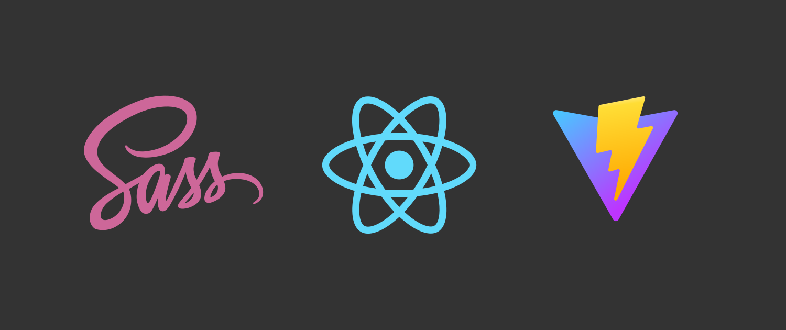

Cover image for the blog post: https://dev.to/hexcube/how-to-add-sass-support-to-a-vite-react-app-37p

### CREDITS
Made from logos of [Sass](https://commons.wikimedia.org/wiki/File:Sass_Logo_Color.svg), [Vite](https://vitejs.dev) and [React](https://commons.wikimedia.org/wiki/File:React-icon.svg)

